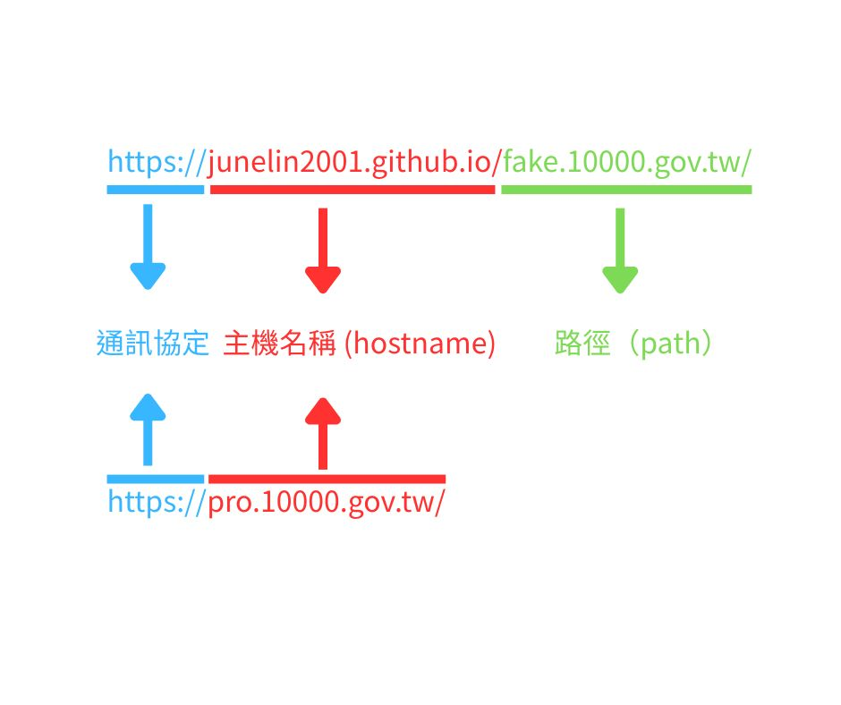

# 假裝自己是 gov.tw 網域的測試網站

> https://junelin2001.github.io/fake.10000.gov.tw/

## 原理

大家可能會覺得 `.gov` 網域只有政府單位能申請

但其實可以假裝自己是 `.gov` 網域

以普發一萬的網站為例子，如果有個網站長這樣：

> https://junelin2001.github.io/fake.10000.gov.tw/

可能一看到結尾是 `.gov` 就會相信他是個政府網站  
但其實那個 `.gov` 是網址的 path 部分

path 是任何網站都可以自訂的  
真正只有政府單位才能申請的 `.gov` 網域是屬於 hostname 部分  
或說的更精確一點應該是[頂級域名（Top-level Domain, TLD）](https://zh.wikipedia.org/zh-tw/%E9%A0%82%E7%B4%9A%E5%9F%9F)  
而單純的 `.gov` 只有美國政府可以使用，其他國家的政府單位要使用 `.gov` 則需要在後面加上對應的國家或地區代碼，如 `.gov.uk`、 `.gov.tw` 等

## 真的騙的到人嗎?

應該吧  
如果要弄得更像一點就去買個拼法更像的網域  
啊我沒錢所以就用免費的 github page

## 總結

不要只看最後面是不是 `.gov` ㄏㄚ ˋ

## 延伸閱讀

- [網址最後為什麼都長一樣？你必須知道的「頂級域」知識](https://pansci.asia/archives/203405)
- [主網域、子網域、網域寄放和附加網域是什麼？對 SEO 有何影響？](https://bettywutalk.com/blog/domains/)
- [什麼是 URL 網址 IP ？ 網域 Domain 中文 意思是什麼？](https://www.design-hu.com/web-news/domain.html)
- [.gov - 維基百科，自由的百科全書](https://zh.wikipedia.org/zh-tw/.gov)
- [gov 網址也可能是假的？收到「普發萬元」簡訊別急著點！一眼看破真偽關鍵就在「這一點」](https://blog.trendmicro.com.tw/?p=88720)
